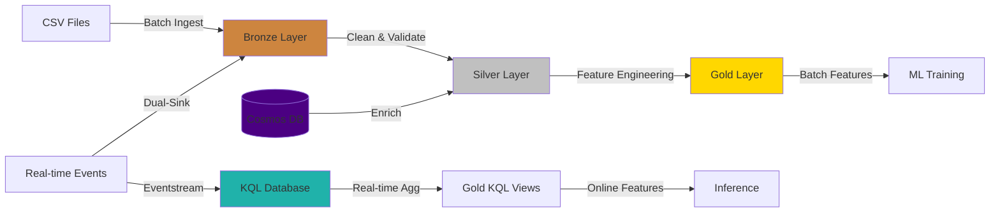
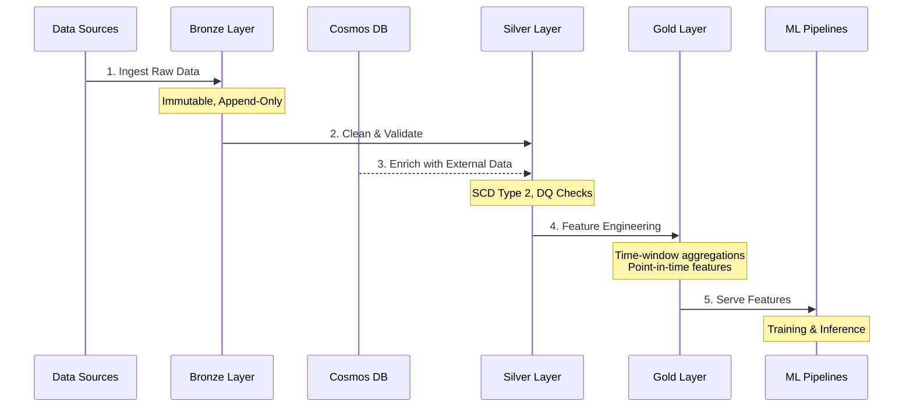

# Insurance ML Data Platform

<div align="center">


**Production-Ready Medallion Architecture for ML Workflows on Microsoft Fabric**

[Features](#-key-features) •
[Architecture](#-architecture) •
[Quick Start](#-quick-start) •
[Documentation](#-documentation)

</div>

---

## 📋 Project Goals

This repository provides a **reusable, production-grade data engineering framework** for insurance ML workflows on Microsoft Fabric, implementing:

- ✅ **Medallion Architecture** (Bronze → Silver → Gold) for data quality and governance
- ✅ **Batch + Real-time** processing with dual-sink pattern for unified analytics
- ✅ **Point-in-time correctness** ensuring ML training/inference consistency
- ✅ **NoSQL enrichment** via Azure Cosmos DB for external data integration
- ✅ **Automated CI/CD** deployment across environments
- ✅ **Framework reusability** - configuration-driven design for rapid project adaptation

## 🚀 Key Features

| Feature | Description | Technology |
|---------|-------------|------------|
| **Medallion Layers** | Bronze (raw) → Silver (curated) → Gold (ML features) | Delta Lake, PySpark |
| **Dual-Sink Streaming** | Real-time events → KQL (low-latency) + Lakehouse (batch replay) | Eventstream, KQL Database |
| **NoSQL Enrichment** | External risk scores & underwriting data integration | Azure Cosmos DB |
| **Point-in-Time Join** | SCD Type 2 + feature timestamps for temporal consistency | Delta Lake, Spark SQL |
| **Data Quality** | Schema contracts, null checks, duplicate detection, freshness SLA, Great Expectations | Great Expectations, Custom validators |
| **CI/CD Pipeline** | Automated deployment with approval gates & rollback | Azure DevOps, Fabric API |
| **Monitoring** | Real-time lag, data quality scores, pipeline metrics | KQL, Monitoring Hub |

## 🏗️ Architecture

### Medallion Design



### Data Flow Sequence



## 🔧 Key Components & Technology

| Component | Description | Technology Stack |
|-----------|-------------|------------------|
| **Lakehouse Storage** | Delta Lake tables with ACID transactions | Microsoft Fabric Lakehouse, Delta Lake 3.0 |
| **Data Processing** | Distributed ETL/ELT transformations | PySpark 3.5 (Fabric runtime) |
| **NoSQL Database** | External enrichment data store | Azure Cosmos DB (NoSQL API) |
| **Streaming** | Real-time event ingestion & processing | Eventstream, KQL Database |
| **Orchestration** | Pipeline scheduling & dependencies | Fabric Data Pipelines (master pipelines) |
| **CI/CD** | Automated deployment automation | Azure DevOps, Fabric Deployment Pipelines |
| **Data Quality** | Dual validation system: standard validators (inline) + Great Expectations (gate) | Custom validators (6 functions), Great Expectations |
| **Secrets Management** | Secure credential storage | Azure Key Vault |
| **Monitoring** | Pipeline metrics & alerting | Fabric Monitoring Hub, KQL Queries |

## 📂 Project Structure

```
Insurance-ML-Data-Platform/
│
├── framework/                          # Reusable Framework
│   ├── config/                        # Configuration Files
│   │   ├── schema_contracts/          # YAML schema definitions (15 files)
│   │   ├── cosmos.yaml                # Cosmos DB settings
│   │   ├── eventstream.yaml           # Streaming config
│   │   ├── great_expectations_rules.yaml  # Great Expectations validation rules
│   │   ├── schema_bronze.yaml         # Bronze layer schema
│   │   ├── schema_silver.yaml         # Silver layer schema
│   │   └── schema_gold.yaml           # Gold layer schema
│   │
│   ├── libs/                          # Core Libraries (10 modules)
│   │   ├── __init__.py                # Module exports
│   │   ├── delta_ops.py               # Delta Lake operations (read, write, merge, optimize)
│   │   ├── data_quality.py            # DQ validation functions (6 validators)
│   │   ├── great_expectations_validator.py  # Great Expectations integration
│   │   ├── cosmos_io.py               # Cosmos DB connector (connect, query, enrich)
│   │   ├── schema_contracts.py        # Schema validation (load, validate, enforce)
│   │   ├── watermarking.py            # Incremental processing (get, update, reset watermarks)
│   │   ├── feature_utils.py           # Feature engineering (aggregations, SCD2, point-in-time)
│   │   ├── logging_utils.py           # Logging & monitoring utilities
│   │   └── alerting.py                # Data quality alerting service
│   │
│   ├── scripts/                       # Management Scripts (5 scripts)
│   │   ├── __init__.py                # Module exports
│   │   ├── initialize_watermark_table.py  # Initialize watermark control table
│   │   ├── delta_maintenance.py       # OPTIMIZE, ZORDER, VACUUM operations
│   │   ├── validate_deployment.py     # Post-deployment validation (all layers)
│   │   └── deploy_to_fabric.py        # Fabric REST API deployment automation
│   │
│   └── setup/                         # Initialization Scripts
│       ├── __init__.py                # Module exports
│       └── init_control_tables.py     # Initialize watermark & DQ results tables
│
├── lakehouse/                         # Medallion Notebooks (18 notebooks)
│   ├── bronze/notebooks/              # Raw data ingestion (6 notebooks)
│   │   ├── ingest_policies.py
│   │   ├── ingest_policies_incremental.py
│   │   ├── ingest_claims.py
│   │   ├── ingest_customers.py
│   │   ├── ingest_agents.py
│   │   └── ingest_stream_events_to_delta.py
│   │
│   ├── silver/notebooks/              # Data cleansing & enrichment (8 notebooks)
│   │   ├── clean_policies.py
│   │   ├── clean_claims.py
│   │   ├── clean_customers.py
│   │   ├── clean_agents.py
│   │   ├── dq_checks.py
│   │   ├── dq_checks_with_great_expectations.py
│   │   ├── enrich_from_cosmos.py
│   │   └── process_streaming_silver.py
│   │
│   └── gold/notebooks/                # ML feature engineering (4 notebooks)
│       ├── create_claims_features.py
│       ├── create_customer_features.py
│       ├── create_risk_features.py
│       └── aggregate_streaming_features.py
│
├── streaming/                         # Real-time Assets
│   ├── eventstream/
│   │   └── outputs/                   # KQL & Lakehouse dual-sink configuration
│   │
│   └── kql/                           # KQL Database
│       ├── tables/                    # Table definitions
│       └── aggregations/              # Materialized views for real-time metrics
│
├── pipelines/                         # Orchestration (2 pipelines)
│   ├── gold/
│   │   └── gold_realtime_aggregation.json # Streaming feature aggregation
│   └── orchestration/
│       └── master_batch_pipeline.json     # Master batch orchestration (Bronze→Silver→Gold)
│
├── devops/                            # CI/CD
│   ├── pipelines/
│   │   ├── azure-pipelines-ci.yml     # Continuous integration (config validation, syntax checks)
│   │   └── azure-pipelines-cd.yml     # Continuous deployment (Fabric workspace deployment)
│   │
│   └── parameters/
│       └── fabric.yml                 # Unified Fabric workspace configuration
│
├── samples/                           # Sample Data
│   ├── batch/                         # CSV files (policies, claims, customers, agents)
│   ├── streaming/                     # JSON events (realtime claims)
│   └── nosql/                         # Cosmos enrichment data
│
├── monitoring/                        # Monitoring & Reporting
│   ├── dashboards/                    # JSON dashboard definitions (2 dashboards)
│   │   ├── data_quality_dashboard.json
│   │   └── pipeline_performance_dashboard.json
│   └── scripts/
│       └── generate_data_quality_report.py  # DQ summary report generator
│
├── .gitignore                         # Git ignore patterns
├── LICENSE                            # MIT License
├── requirements.txt                   # Python dependencies (Fabric runtime)
└── README.md                          # This file
```

## 🚀 Quick Start

### Prerequisites

- Azure subscription with Microsoft Fabric capacity
- Azure Cosmos DB account (NoSQL API)
- Azure DevOps project
- GitHub repository (or Azure DevOps Git)
- Python 3.9+

### Installation & Setup

```bash
# Clone the repository
git clone https://github.com/yourorg/Insurance-ML-Data-Platform.git
cd Insurance-ML-Data-Platform

# Verify configuration files (optional)
python -c "import yaml; print(yaml.safe_load(open('devops/parameters/fabric.yml')))"
```

**Note**: All development and testing are performed directly in Microsoft Fabric workspace. Notebooks import framework libraries via `sys.path.append("/Workspace/framework/libs")`. No local development setup required.

### Deployment Steps

1. **Provision Microsoft Fabric Workspace**
   ```bash
   # Create single Fabric Workspace: Insurance-ML-Platform
   # - Lakehouses: lh_bronze, lh_silver, lh_gold
   # - Eventstream: es_insurance_realtime
   # - KQL Database: kql_insurance_realtime
   # Update workspace ID in devops/parameters/fabric.yml
   ```

2. **Configure Cosmos DB**
   ```bash
   # Create Cosmos DB account (NoSQL API)
   # Create containers: policy-enrichment, customer-risk-profiles
   # Import sample data from samples/nosql/
   ```

3. **Setup Azure Key Vault**
   ```bash
   # Create Key Vault: kv-insurance-ml-platform
   # Store secrets:
   # - cosmosEndpoint, cosmosKey
   # - fabricToken (service principal)
   # Grant access to Azure DevOps service connection
   ```

4. **Configure Azure DevOps**
   ```bash
   # Import pipelines:
   # - devops/pipelines/azure-pipelines-ci.yml (PR validation)
   # - devops/pipelines/azure-pipelines-cd.yml (deployment)
   # 
   # Create Variable Group 'Fabric-Secrets':
   # - azureServiceConnection: <your-azure-service-connection>
   # - keyVaultName: kv-insurance-ml-platform
   # Link Variable Group to Key Vault
   ```

5. **Deploy Code to Fabric**
   ```bash
   # Option A: Azure DevOps Pipeline
   git push origin main  # Triggers azure-pipelines-cd.yml
   
   # Option B: Manual upload via Fabric Git integration
   # Configure Fabric Workspace → Git integration → Azure DevOps repo
   ```

6. **Initialize Control Tables**
   ```bash
   # In Fabric Workspace, run initialization script:
   # framework/setup/init_control_tables.py
   # This will create:
   # - watermark_control table
   # - dq_check_results table
   ```

7. **Upload Sample Data**
   ```bash
   # Upload sample CSV files to Lakehouse Files:
   # - Files/samples/batch/policies.csv
   # - Files/samples/batch/claims.csv
   # - Files/samples/batch/customers.csv
   # - Files/samples/batch/agents.csv
   ```

8. **Validate Deployment**
   ```bash
   # In Fabric Workspace:
   # 1. Run master_batch_pipeline
   # 2. Check Tables: bronze_*, silver_*, gold_*
   # 3. Query KQL Database for streaming events
   # 4. Execute framework/scripts/validate_deployment.py
   # 5. View monitoring dashboards
   ```

### Testing & Validation in Fabric

All testing and validation are performed directly in Microsoft Fabric workspace (no local development required):

**1. Data Quality Validation:**
```bash
# Standard DQ Checks (fast, always run in pipeline):
# Execute: lakehouse/silver/notebooks/dq_checks.py
# - Uses: data_quality.py validators (duplicates, nulls, freshness)
# - Output: Tables/dq_check_results

# Great Expectations Checks (advanced, optional gate):
# Execute: lakehouse/silver/notebooks/dq_checks_with_great_expectations.py
# - Uses: great_expectations_validator.py
# - Config: framework/config/great_expectations_rules.yaml
# - Output: Tables/dq_check_results_ge
# - Features: Regex, date formats, statistical profiling

# Note: Both systems are complementary, not mutually exclusive
```

**2. End-to-End Pipeline Testing:**
```bash
# Execute master_batch_pipeline in Fabric to test complete flow:
# Bronze ingestion → Silver cleaning → Silver DQ checks → 
# Silver Cosmos enrichment → Gold feature engineering
```

**3. Post-Deployment Validation:**
```bash
# Execute in Fabric Workspace:
# framework/scripts/validate_deployment.py
# Validates all Delta tables (Bronze/Silver/Gold) and control tables
```

**4. Maintenance Operations:**
```bash
# Delta Lake optimization (OPTIMIZE, ZORDER, VACUUM):
# Execute: framework/scripts/delta_maintenance.py

# Initialize control tables (watermark + DQ results):
# Execute: framework/setup/init_control_tables.py

# Generate DQ summary report:
# Execute: monitoring/scripts/generate_data_quality_report.py
```

## 📚 Framework Usage Examples

### Delta Lake Operations

```python
from framework.libs.delta_ops import read_delta, write_delta, merge_delta

# Read Delta table with time travel
df = read_delta(spark, "Tables/silver_policies", version=5)

# Write partitioned table
write_delta(df, "Tables/gold_features", partition_by=["date"], mode="append")

# MERGE upsert (SCD2 pattern)
merge_delta(
    spark, "Tables/target", source_df, 
    "target.id = source.id",
    when_matched_update={"value": "source.value"},
    when_not_matched_insert={"id": "source.id", "value": "source.value"}
)
```

### Data Quality Validation (Dual System)

**System 1: Standard Validators (Lightweight, Inline)**
```python
from framework.libs.data_quality import check_nulls, detect_duplicates, check_freshness

# Used in: clean_*.py notebooks for inline validation during transformations
# Purpose: Fast fail-fast checks

# Check null ratios
null_result = check_nulls(df, columns=["customer_id", "policy_id"], threshold=0.01)
if not null_result["passed"]:
    logger.warning(f"Null violations: {null_result['violations']}")

# Detect duplicates
dup_result = detect_duplicates(df, key_columns=["policy_id"])
assert dup_result["passed"], f"Found {dup_result['duplicate_count']} duplicates"

# Data freshness check
freshness = check_freshness(df, timestamp_column="ingestion_timestamp", max_age_hours=24)
```

**System 2: Great Expectations (Advanced, Validation Gate)**
```python
from framework.libs.great_expectations_validator import validate_with_great_expectations

# Used in: dq_checks_with_great_expectations.py for deep validation
# Config: framework/config/great_expectations_rules.yaml
# Purpose: Statistical profiling, regex patterns, advanced constraints

# Define expectations
expectations = [
    {
        "expectation_type": "expect_column_values_to_not_be_null",
        "column": "policy_id"
    },
    {
        "expectation_type": "expect_column_values_to_be_between",
        "column": "premium",
        "min_value": 0,
        "max_value": 1000000,
        "mostly": 0.99  # Allow 1% outliers
    },
    {
        "expectation_type": "expect_column_values_to_match_regex",
        "column": "email",
        "regex": "^[a-zA-Z0-9._%+-]+@[a-zA-Z0-9.-]+\\.[a-zA-Z]{2,}$"
    }
]

# Run validation
results = validate_with_great_expectations(
    df=df_policies,
    table_name="silver_policies",
    expectations_config=expectations
)

if results["success"]:
    logger.info("All Great Expectations checks passed!")
else:
    logger.error(f"Failed expectations: {results['results']}")
```

**When to Use Which:**
- **Standard Validators**: Inline checks in transformation notebooks (clean_*.py), fast comprehensive checks (dq_checks.py)
- **Great Expectations**: Optional deep validation gate (dq_checks_with_great_expectations.py), advanced statistical profiling

### Cosmos DB Enrichment

```python
from framework.libs.cosmos_io import enrich_dataframe

# Enrich policies with external risk scores
enriched_df = enrich_dataframe(
    spark=spark,
    df=policies_df,
    cosmos_endpoint=cosmos_endpoint,
    cosmos_key=cosmos_key,
    cosmos_database="insurance",
    cosmos_container="policy-enrichment",
    join_keys=["policy_id"],
    select_columns=["risk_score", "underwriting_flags"],
    broadcast_cosmos=True  # For small Cosmos datasets
)
```

### Point-in-Time Feature Join

```python
from framework.libs.feature_utils import generate_point_in_time_view

# Get features valid at specific event time (for ML training)
pit_features = generate_point_in_time_view(
    feature_df=gold_features,
    entity_keys=["customer_id"],
    event_time_column="feature_timestamp",
    valid_from_column="effective_from",
    valid_to_column="effective_to",
    as_of_timestamp="2025-01-15T00:00:00"
)
```

## 📖 Architecture Summary

This platform implements a **production-ready medallion architecture** with the following key capabilities:

### Core Architecture Patterns

1. **Medallion Data Flow**
   - **Bronze Layer**: Immutable raw data ingestion with full lineage (6 ingestion notebooks)
   - **Silver Layer**: Cleaned, validated, enriched data with SCD Type 2 tracking (8 transformation notebooks)
   - **Gold Layer**: ML-ready feature tables with point-in-time correctness (4 feature notebooks)

2. **Dual-Sink Streaming**
   - **KQL Database**: Low-latency queries for real-time monitoring and alerts
   - **Lakehouse Bronze**: Historical replay capability for batch ML training

3. **Dual Data Quality System**
   
   **System 1: Standard Validators (`data_quality.py`)**
   - **Purpose**: Lightweight inline checks during transformations
   - **Validators**: 6 functions (schema, null_ratio, duplicates, freshness, value_range, completeness)
   - **Used by**: All `clean_*.py` notebooks (inline validation), `dq_checks.py` (comprehensive validation)
   - **Output**: `Tables/dq_check_results`
   
   **System 2: Great Expectations (`great_expectations_validator.py`)**
   - **Purpose**: Advanced statistical validation gate for Silver layer
   - **Config**: `framework/config/great_expectations_rules.yaml` (126 lines, 6 tables)
   - **Used by**: `dq_checks_with_great_expectations.py` (optional deep validation)
   - **Output**: `Tables/dq_check_results_ge`
   - **Advanced Features**: Regex patterns, date formats, statistical profiling, mostly parameter
   
   **Alerting Service**: Configurable alerts for DQ failures (webhook integration ready)

4. **Point-in-Time Correctness**
   - SCD Type 2 dimensions for historical tracking
   - Feature timestamps for temporal consistency in ML training
   - Incremental processing with watermark control

5. **Deployment Automation**
   - **CI Pipeline**: Configuration validation, syntax checks (azure-pipelines-ci.yml)
   - **CD Pipeline**: Automated deployment to Fabric workspace (azure-pipelines-cd.yml)
   - **Post-Deployment Validation**: Automated validation of all layers and control tables

## 🤝 Contributing & Extension

- **Add New Data Source**: Copy `lakehouse/bronze/notebooks/ingest_*.py` template
- **Custom Features**: Extend `lakehouse/gold/notebooks/create_*_features.py`
- **New Schema Contracts**: Add YAML definitions to `framework/config/`
- **Framework Enhancement**: Extend `framework/libs/` modules

## 📝 License

This project is licensed under the MIT License - see the LICENSE file for details.

## 👥 Author

**Patrick Cheung**  
Built for production ML workflows on Microsoft Fabric

For questions, issues, or contributions, please open a GitHub issue or contact the maintainers.

---

<div align="center">

**[⬆ Back to Top](#insurance-ml-data-platform)**

Made with Microsoft Fabric | Powered by Delta Lake | Secured by Azure

</div>
