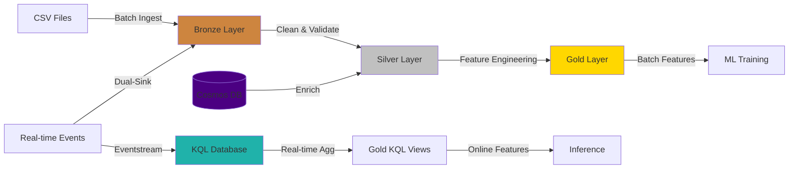
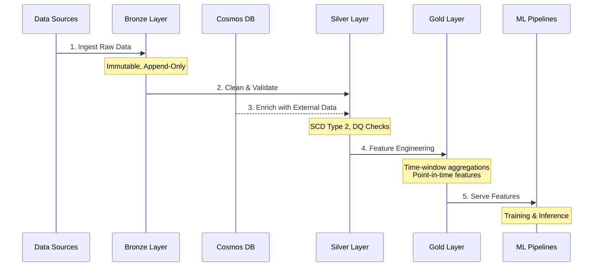

# Insurance ML Data Platform

<div align="center">


**Production-Ready Medallion Architecture for ML Workflows on Microsoft Fabric**

[Features](#-key-features) •
[Architecture](#-architecture) •
[Quick Start](#-quick-start) •
[Documentation](#-documentation)

</div>

---

## 📋 Project Goals

This repository provides a **reusable, production-grade data engineering framework** for insurance ML workflows on Microsoft Fabric, implementing:

- ✅ **Medallion Architecture** (Bronze → Silver → Gold) for data quality and governance
- ✅ **Batch + Real-time** processing with dual-sink pattern for unified analytics
- ✅ **Point-in-time correctness** ensuring ML training/inference consistency
- ✅ **NoSQL enrichment** via Azure Cosmos DB for external data integration
- ✅ **Automated CI/CD** deployment across environments
- ✅ **Framework reusability** - configuration-driven design for rapid project adaptation

## 🚀 Key Features

| Feature | Description | Technology |
|---------|-------------|------------|
| **Medallion Layers** | Bronze (raw) → Silver (curated) → Gold (ML features) | Delta Lake, PySpark |
| **Dual-Sink Streaming** | Real-time events → KQL (low-latency) + Lakehouse (batch replay) | Eventstream, KQL Database |
| **NoSQL Enrichment** | External risk scores & underwriting data integration | Azure Cosmos DB |
| **Point-in-Time Join** | SCD Type 2 + feature timestamps for temporal consistency | Delta Lake, Spark SQL |
| **Data Quality** | Schema contracts, null checks, duplicate detection, freshness SLA | Great Expectations, Custom |
| **CI/CD Pipeline** | Automated deployment with approval gates & rollback | Azure DevOps, Fabric API |
| **Monitoring** | Real-time lag, data quality scores, pipeline metrics | KQL, Monitoring Hub |

## 🏗️ Architecture

### Medallion Design



### Data Flow Sequence



## 🔧 Key Components & Technology

| Component | Description | Technology Stack |
|-----------|-------------|------------------|
| **Lakehouse Storage** | Delta Lake tables with ACID transactions | Microsoft Fabric Lakehouse, Delta Lake 3.0 |
| **Data Processing** | Distributed ETL/ELT transformations | PySpark 3.5, Databricks Runtime |
| **NoSQL Database** | External enrichment data store | Azure Cosmos DB (NoSQL API) |
| **Streaming** | Real-time event ingestion & processing | Eventstream, KQL Database |
| **Orchestration** | Pipeline scheduling & dependencies | Data Factory, Master Pipelines |
| **CI/CD** | Automated deployment automation | Azure DevOps, Fabric Deployment Pipelines |
| **Data Quality** | Validation frameworks & monitoring | Great Expectations, Custom validators |
| **Secrets Management** | Secure credential storage | Azure Key Vault |
| **Monitoring** | Pipeline metrics & alerting | Fabric Monitoring Hub, KQL Queries |

## 📂 Project Structure

```
Insurance-ML-Data-Platform/
│
├── framework/                          # Reusable Framework
│   ├── config/                        # Configuration Files
│   │   ├── medallion.yaml             # Layer definitions
│   │   ├── cosmos.yaml                # Cosmos DB settings
│   │   ├── eventstream.yaml           # Streaming config
│   │   ├── environment.dev.yaml       # Dev environment
│   │   └── environment.prod.yaml      # Prod environment
│   │
│   └── libs/                          # Core Libraries
│       ├── delta_ops.py               # Delta Lake operations
│       ├── data_quality.py            # DQ validation functions
│       ├── cosmos_io.py               # Cosmos DB connector
│       ├── schema_contracts.py        # Schema validation
│       ├── watermarking.py            # Incremental processing
│       ├── feature_utils.py           # Feature engineering
│       └── logging_utils.py           # Logging & monitoring
│
├── lakehouse/                         # Medallion Notebooks
│   ├── bronze/notebooks/              # Raw data ingestion
│   │   ├── ingest_policies.py
│   │   ├── ingest_claims.py
│   │   ├── ingest_customers.py
│   │   ├── ingest_agents.py
│   │   └── ingest_stream_events_to_delta.py
│   │
│   ├── silver/notebooks/              # Data cleansing & enrichment
│   │   ├── clean_policies.py          # SCD2 implementation
│   │   ├── clean_claims.py
│   │   ├── clean_customers.py
│   │   ├── dq_checks.py               # Data quality validation
│   │   ├── enrich_from_cosmos.py      # Cosmos enrichment
│   │   └── process_streaming_silver.py # Streaming data processing
│   │
│   └── gold/notebooks/                # ML feature engineering
│       ├── create_claims_features.py  # Time-window aggregations
│       ├── create_customer_features.py # Customer metrics
│       ├── create_risk_features.py    # Risk assessment
│       └── aggregate_streaming_features.py # Real-time feature aggregation
│
├── streaming/                         # Real-time Assets
│   ├── eventstream/
│   │   └── outputs/                   # KQL & Lakehouse sinks
│   │
│   └── kql/                           # KQL Database
│       ├── tables/                    # Table definitions
│       └── aggregations/              # Materialized views
│
├── pipelines/                         # Orchestration
│   ├── gold/
│   │   └── gold_realtime_aggregation.json # Streaming feature aggregation
│   └── orchestration/
│       └── master_batch_pipeline.json     # Master batch orchestration (Bronze→Silver→Gold)
│
├── devops/                            # CI/CD
│   ├── pipelines/
│   │   ├── azure-pipelines-ci.yml     # Continuous integration (PR validation, tests)
│   │   └── azure-pipelines-cd.yml     # Continuous deployment (Fabric deployment)
│   │
│   └── parameters/
│       └── fabric.yml                 # Unified Fabric workspace configuration
│
├── tests/                             # Testing
│   ├── unit/                          # Unit tests
│   └── integration/                   # Integration tests
│
├── samples/                           # Sample Data
│   ├── batch/                         # CSV files
│   ├── streaming/                     # JSON events
│   └── nosql/                         # Cosmos enrichment data
│
├── requirements.txt                   # Python dependencies
└── README.md                          # This file
```

## 🚀 Quick Start

### Prerequisites

- Azure subscription with Microsoft Fabric capacity
- Azure Cosmos DB account (NoSQL API)
- Azure DevOps project
- GitHub repository (or Azure DevOps Git)
- Python 3.9+

### Installation & Setup

```bash
# Clone the repository
git clone https://github.com/yourorg/Insurance-ML-Data-Platform.git
cd Insurance-ML-Data-Platform

# Install Python dependencies
pip install -r requirements.txt

# Verify configuration
python -c "import yaml; print(yaml.safe_load(open('framework/config/medallion.yaml')))"
```

### Deployment Steps

1. **Provision Microsoft Fabric Workspace**
   ```bash
   # Create single Fabric Workspace: Insurance-ML-Platform
   # - Lakehouses: lh_bronze, lh_silver, lh_gold
   # - Eventstream: es_insurance_realtime
   # - KQL Database: kql_insurance_realtime
   # Update workspace ID in devops/parameters/fabric.yml
   ```

2. **Configure Cosmos DB**
   ```bash
   # Create Cosmos DB account (NoSQL API)
   # Create containers: policy-enrichment, customer-risk-profiles
   # Import sample data from samples/nosql/
   ```

3. **Setup Azure Key Vault**
   ```bash
   # Create Key Vault: kv-insurance-ml-platform
   # Store secrets:
   # - cosmosEndpoint, cosmosKey
   # - fabricToken (service principal)
   # Grant access to Azure DevOps service connection
   ```

4. **Configure Azure DevOps**
   ```bash
   # Import pipelines:
   # - devops/pipelines/azure-pipelines-ci.yml (PR validation)
   # - devops/pipelines/azure-pipelines-cd.yml (deployment)
   # 
   # Create Variable Group 'Fabric-Secrets':
   # - azureServiceConnection: <your-azure-service-connection>
   # - keyVaultName: kv-insurance-ml-platform
   # Link Variable Group to Key Vault
   ```

5. **Deploy Code to Fabric**
   ```bash
   # Option A: Azure DevOps Pipeline
   git push origin main  # Triggers azure-pipelines-cd.yml
   
   # Option B: Manual upload via Fabric Git integration
   # Configure Fabric Workspace → Git integration → Azure DevOps repo
   ```

6. **Validate Deployment**
   ```bash
   # In Fabric Workspace:
   # 1. Open master_batch_pipeline → Run
   # 2. Check Tables: bronze_*, silver_*, gold_*
   # 3. Query KQL Database for streaming events
   # 4. View monitoring dashboards
   ```

### Local Development

```bash
# Run unit tests
pytest tests/unit/ -v

# Run integration tests (requires Fabric workspace)
pytest tests/integration/ -v

# Lint code
flake8 framework/ lakehouse/

# Format code
black framework/ lakehouse/
```

## 📚 Framework Usage Examples

### Delta Lake Operations

```python
from framework.libs.delta_ops import read_delta, write_delta, merge_delta

# Read Delta table with time travel
df = read_delta(spark, "Tables/silver_policies", version=5)

# Write partitioned table
write_delta(df, "Tables/gold_features", partition_by=["date"], mode="append")

# MERGE upsert (SCD2 pattern)
merge_delta(
    spark, "Tables/target", source_df, 
    "target.id = source.id",
    when_matched_update={"value": "source.value"},
    when_not_matched_insert={"id": "source.id", "value": "source.value"}
)
```

### Data Quality Validation

```python
from framework.libs.data_quality import check_nulls, detect_duplicates, check_freshness

# Check null ratios
null_result = check_nulls(df, columns=["customer_id", "policy_id"], threshold=0.01)
if not null_result["passed"]:
    logger.warning(f"Null violations: {null_result['violations']}")

# Detect duplicates
dup_result = detect_duplicates(df, key_columns=["policy_id"])
assert dup_result["passed"], f"Found {dup_result['duplicate_count']} duplicates"

# Data freshness check
freshness = check_freshness(df, timestamp_column="ingestion_timestamp", max_age_hours=24)
```

### Cosmos DB Enrichment

```python
from framework.libs.cosmos_io import enrich_dataframe

# Enrich policies with external risk scores
enriched_df = enrich_dataframe(
    spark=spark,
    df=policies_df,
    cosmos_endpoint=cosmos_endpoint,
    cosmos_key=cosmos_key,
    cosmos_database="insurance",
    cosmos_container="policy-enrichment",
    join_keys=["policy_id"],
    select_columns=["risk_score", "underwriting_flags"],
    broadcast_cosmos=True  # For small Cosmos datasets
)
```

### Point-in-Time Feature Join

```python
from framework.libs.feature_utils import generate_point_in_time_view

# Get features valid at specific event time (for ML training)
pit_features = generate_point_in_time_view(
    feature_df=gold_features,
    entity_keys=["customer_id"],
    event_time_column="feature_timestamp",
    valid_from_column="effective_from",
    valid_to_column="effective_to",
    as_of_timestamp="2025-01-15T00:00:00"
)
```

## 📖 Architecture & Deployment

All architecture documentation and deployment instructions are contained in this README. Key concepts:

- **Medallion Architecture**: Bronze (raw) → Silver (curated with SCD2) → Gold (ML features)
- **Dual-Sink Pattern**: Eventstream → KQL Database (real-time) + Lakehouse (batch replay)
- **Point-in-Time Correctness**: SCD Type 2 + feature timestamps for ML training/inference consistency
- **Deployment**: Single unified environment via `devops/pipelines/azure-pipelines-cd.yml`

## 🤝 Contributing & Extension

- **Add New Data Source**: Copy `lakehouse/bronze/notebooks/ingest_*.py` template
- **Custom Features**: Extend `lakehouse/gold/notebooks/create_*_features.py`
- **New Schema Contracts**: Add YAML definitions to `framework/config/`
- **Framework Enhancement**: Extend `framework/libs/` modules

## 📝 License

This project is licensed under the MIT License - see the LICENSE file for details.

## 👥 Author

**Patrick Cheung**  
Built for production ML workflows on Microsoft Fabric

For questions, issues, or contributions, please open a GitHub issue or contact the maintainers.

---

<div align="center">

**[⬆ Back to Top](#insurance-ml-data-platform)**

Made with Microsoft Fabric | Powered by Delta Lake | Secured by Azure

</div>
