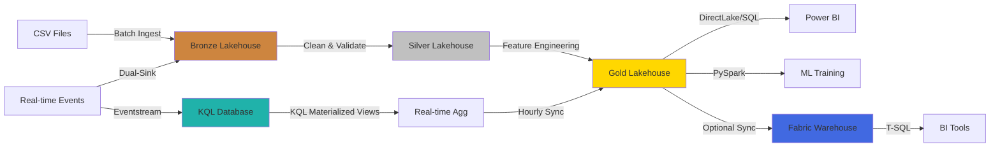
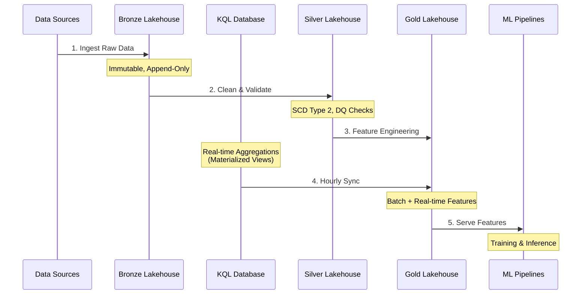

# Insurance ML Data Platform

<div align="center">


**Simplified Dual Medallion Architecture (Batch + Event) for ML Workflows on Microsoft Fabric**

[Features](#-key-features) •
[Architecture](#%EF%B8%8F-architecture) •
[Quick Start](#-quick-start) •
[Project Structure](#-project-structure)

</div>

---

## 📋 Project Goals

This repository provides a **simplified, demonstration-focused** Medallion architecture for insurance ML workflows on Microsoft Fabric:

- ✅ **Fabric Native** - 100% Fabric services (Lakehouse + KQL + Eventstream)
- ✅ **Dual Medallion Pattern** - Batch (CSV) + Event (real-time) pipelines
- ✅ **SCD Type 2** - Simplified historical tracking in Silver layer
- ✅ **Schema Validation** - YAML-based contracts with inline enforcement
- ✅ **Purview Integration** - Basic metadata tagging for data catalog
- ✅ **No Framework Dependencies** - All code inline in notebooks
- ✅ **Git Integration Ready** - Deploy via Fabric Git Integration

## 🚀 Key Features

| Feature | Description | Technology |
|---------|-------------|------------|
| **Batch Medallion** | CSV → Bronze → Silver → Gold (daily batch) | Delta Lake, PySpark |
| **Event Medallion** | Eventstream → KQL + Bronze → Silver → Gold (real-time) | Eventstream, KQL Database, Delta Lake |
| **Schema Validation** | YAML contracts with inline enforcement | PyYAML |
| **SCD Type 2** | Simplified historical tracking (effective_from, effective_to, is_current) | Delta Lake |
| **Dual Sink** | Real-time events → KQL (queries) + Lakehouse (ML) | Eventstream destinations |
| **Purview Metadata** | Table descriptions via Delta properties | Delta Lake options |
| **Deployment** | Fabric Git Integration (Azure DevOps or GitHub) | Fabric Git Integration |

## 🏗️ Architecture

### Medallion Design



### Data Flow Sequence



## 🔧 Key Components & Technology

| Component | Description | Technology Stack |
|-----------|-------------|------------------|
| **Lakehouse Storage** | Delta Lake tables with ACID transactions | Microsoft Fabric Lakehouse, Delta Lake 3.0 |
| **Data Processing** | Distributed ETL/ELT transformations | PySpark 3.5 (Fabric runtime) |
| **SQL Access** | SQL endpoint (automatic) + Warehouse (optional) | Lakehouse SQL Endpoint, Fabric Warehouse |
| **Streaming** | Real-time event ingestion & processing | Eventstream, KQL Database |
| **Orchestration** | Pipeline scheduling & dependencies | Fabric Data Pipelines (master pipelines) |
| **CI/CD** | Automated deployment automation | Azure DevOps, Fabric Deployment Pipelines |
| **Data Quality** | Dual validation system: standard validators (inline) + Great Expectations (gate) | Custom validators (6 functions), Great Expectations |
| **Secrets Management** | Secure credential storage | Azure Key Vault |
| **Monitoring** | Pipeline metrics & alerting | Fabric Monitoring Hub, KQL Queries |
| **Data Governance** | Data catalog, lineage tracking, metadata management | Microsoft Purview Hub (native Fabric integration) |

## 📂 Project Structure

```
Insurance-ML-Data-Platform/
│
├── lakehouse/                         # Medallion Notebooks (14 notebooks)
│   ├── bronze/notebooks/              # Raw data ingestion (4 batch notebooks)
│   │   ├── ingest_policies.py                 # Policies ingestion + schema validation
│   │   ├── ingest_claims.py                   # Claims ingestion + schema validation
│   │   ├── ingest_customers.py                # Customers ingestion + schema validation
│   │   └── ingest_agents.py                   # Agents ingestion + schema validation
│   │
│   ├── silver/notebooks/              # Data cleansing (5 notebooks)
│   │   ├── clean_policies.py                  # Clean + SCD Type 2 for policies
│   │   ├── clean_claims.py                    # Clean + SCD Type 2 for claims
│   │   ├── clean_customers.py                 # Clean + SCD Type 2 for customers
│   │   ├── clean_agents.py                    # Clean + SCD Type 2 for agents
│   │   └── process_realtime_claims.py         # Real-time claims processing
│   │
│   └── gold/notebooks/                # ML features (4 notebooks)
│       ├── create_claims_features.py          # Batch claims aggregations
│       ├── create_customer_features.py        # Customer features
│       ├── create_risk_features.py            # Risk scores
│       └── sync_kql_to_gold.py                # KQL → Gold sync (hourly)
│
├── pipelines/                         # Orchestration (2 pipelines)
│   ├── master_batch_pipeline.json     # Batch: Bronze → Silver → Gold (daily)
│   └── master_realtime_pipeline.json  # Real-time: Eventstream → Silver → Gold (hourly)
│
├── streaming/                         # Event Medallion (Fabric Native)
│   ├── eventstream_claims_config.json # Eventstream dual-sink config
│   ├── kql/
│   │   ├── create_realtime_table.kql  # KQL table + mapping
│   │   └── realtime_aggregations.kql  # Real-time queries
│   └── README_EVENTSTREAM_SETUP.md    # Setup guide
│
├── framework/config/schemas/          # Schema Contracts (YAML)
│   ├── bronze_policies.yaml
│   ├── bronze_claims.yaml
│   ├── bronze_customers.yaml
│   └── bronze_agents.yaml
│
├── devops/parameters/
│   └── fabric.yml                     # Fabric workspace config
│
├── samples/
│   ├── batch/                         # Batch CSV data (4 files)
│   │   ├── policies.csv
│   │   ├── claims.csv
│   │   ├── customers.csv
│   │   └── agents.csv
│   └── streaming/
│       └── realtime_claims_events.json # Sample event data
│
├── PIPELINE_TRIGGER_GUIDE.md          # Pipeline execution guide
├── .gitignore
├── LICENSE
├── requirements.txt                   # PySpark + Delta Lake + PyYAML
└── README.md
```

## 🚀 Quick Start

### Prerequisites

- Azure subscription with Microsoft Fabric capacity
- Azure DevOps or GitHub repository (for Git Integration)

### Deployment via Fabric Git Integration

**Recommended Method** - Using Fabric Native Git Integration:

```bash
# 1. Create Fabric Workspace
# - Navigate to Fabric Portal
# - Create workspace: Insurance-ML-Platform
# - Create Lakehouses: lh_bronze, lh_silver, lh_gold
# - Create KQL Database: insurance_realtime (for event pipeline)

# 2. Setup Git Integration
# - Workspace Settings → Git Integration
# - Connect to Azure DevOps or GitHub
# - Select repository: Insurance-ML-Data-Platform
# - Branch: main
# - Click "Sync"

# 3. Push changes to Git
git add .
git commit -m "Update notebooks"
git push origin main

# 4. Fabric auto-syncs notebooks and pipelines
# - All .py notebooks in lakehouse/ folder sync automatically
# - Pipelines in pipelines/ folder sync automatically
# - KQL scripts manual run in KQL Database query editor
# - No manual deployment needed!
```

### Setup Sample Data & Files

1. **Upload Sample CSV Files + Schema YAMLs**
   ```bash
   # In Fabric Workspace → lh_bronze → Files
   # Create folders and upload:
   # 
   # Files/samples/batch/
   #   - policies.csv
   #   - claims.csv
   #   - customers.csv
   #   - agents.csv
   #
   # Files/config/schemas/
   #   - bronze_policies.yaml
   #   - bronze_claims.yaml
   #   - bronze_customers.yaml
   #   - bronze_agents.yaml
   ```

2. **Setup Event Pipeline (Optional)**
   ```bash
   # Follow guide: streaming/README_EVENTSTREAM_SETUP.md
   # 1. Create KQL Database: insurance_realtime
   # 2. Run KQL script: create_realtime_table.kql
   # 3. Create Eventstream: claims_eventstream (dual sink)
   # 4. Test with sample: samples/streaming/realtime_claims_events.json
   ```

3. **Run Pipelines**
   ```bash
   # Batch Pipeline (Daily)
   # - Navigate to Pipelines → master_batch_pipeline
   # - Click "Run"
   # - Pipeline executes: Bronze → Silver → Gold
   #
   # Real-time Pipeline (Hourly)
   # - Navigate to Pipelines → master_realtime_pipeline
   # - Click "Run" (after Eventstream setup)
   # - Pipeline syncs: Eventstream → Silver → Gold
   #
   # See detailed trigger instructions below
   ```

4. **Verify Results**
   ```bash
   # Batch tables:
   # - lh_bronze: bronze_policies, bronze_claims, bronze_customers, bronze_agents
   # - lh_silver: silver_* (with SCD2 columns)
   # - lh_gold: gold_claims_features, gold_customer_features, gold_risk_features
   #
   # Real-time tables:
   # - lh_bronze: bronze_claims_events (Eventstream sink)
   # - lh_silver: silver_claims_realtime (with SCD2)
   # - lh_gold: gold_realtime_claims_features (KQL sync)
   # - KQL DB: claims_events, claims_hourly (materialized view)
   ```

## 📚 Code Examples

### Schema Validation (Inline)

All Bronze notebooks validate against YAML schemas:

```python
import yaml

def validate_schema(df, schema_path):
    """Simplified inline schema validation."""
    with open(schema_path, 'r') as f:
        schema = yaml.safe_load(f)
    
    for col_def in schema['required_columns']:
        col_name = col_def['name']
        nullable = col_def['nullable']
        
        if col_name not in df.columns:
            raise ValueError(f"Missing required column: {col_name}")
        
        if not nullable:
            null_count = df.filter(col(col_name).isNull()).count()
            if null_count > 0:
                logger.warning(f"Found {null_count} nulls in {col_name}")
    
    logger.info("✓ Schema validation passed")
    return True

# Usage
validate_schema(df_enriched, "/lakehouse/default/Files/config/schemas/bronze_policies.yaml")
```

### SCD Type 2 Implementation (Simplified)

All Silver notebooks include basic SCD2 tracking:

```python
# Add SCD Type 2 columns
df_cleaned = df_cleaned \
    .withColumn("effective_from", col("ingestion_timestamp")) \
    .withColumn("effective_to", lit(None).cast("timestamp")) \
    .withColumn("is_current", lit(True))
```

### Purview Metadata Integration

Table descriptions are added via Delta table properties:

```python
# Write with Purview metadata
df_cleaned.write \
    .format("delta") \
    .mode("overwrite") \
    .option("description", "Silver layer: Cleaned policies with SCD Type 2 tracking") \
    .save("Tables/silver_policies")

# Fabric automatically syncs to Purview Hub for data catalog
```

## 📖 Architecture Summary

Simplified dual Medallion architecture for demonstration:

### Core Patterns

1. **Dual Medallion Data Flow**
   
   **Batch Pipeline (Daily):**
   - **Bronze Layer**: CSV ingestion with schema validation (4 notebooks)
   - **Silver Layer**: Data cleaning + SCD Type 2 (4 notebooks)
   - **Gold Layer**: Feature aggregations (3 notebooks)
   
   **Event Pipeline (Real-time):**
   - **Eventstream**: Dual-sink to KQL Database + Bronze Lakehouse
   - **KQL Database**: Low-latency real-time queries (<1s)
   - **Silver Layer**: Process events with SCD Type 2 (1 notebook)
   - **Gold Layer**: Sync KQL aggregations hourly (1 notebook)

2. **Schema Validation**
   - YAML-based schema contracts (1 file per table)
   - Inline enforcement in Bronze notebooks
   - Validates: column existence, nullable constraints

3. **SCD Type 2 Tracking**
   - Simplified historical tracking with `effective_from`, `effective_to`, `is_current` columns
   - Applied to all Silver tables (batch + real-time)

4. **Dual Sink Architecture**
   - **KQL Database**: Real-time monitoring dashboards
   - **Lakehouse**: Historical ML training data
   - Single Eventstream → both destinations

5. **Data Quality**
   - Schema validation (Bronze)
   - Basic inline checks (null, duplicates)
   - No complex framework dependencies

6. **Purview Integration**
   - Table descriptions via Delta `.option("description", "...")`
   - Auto-sync to Purview Hub for data catalog

7. **Deployment**
   - Fabric Git Integration (recommended)
   - Auto-sync on git push
   - No manual deployment scripts needed

## 📝 License

This project is licensed under the MIT License - see the LICENSE file for details.

## 📖 Pipeline Execution Guide

### Batch Pipeline Triggers

#### Required Files Location

```
Fabric Workspace: lh_bronze
├── Files/samples/batch/          ← Upload here
│   ├── policies.csv
│   ├── claims.csv
│   ├── customers.csv
│   └── agents.csv
└── Files/config/schemas/         ← Upload here
    ├── bronze_policies.yaml
    ├── bronze_claims.yaml
    ├── bronze_customers.yaml
    └── bronze_agents.yaml
```

#### Manual Execution

1. Navigate to Fabric Portal → Workspace → Pipelines
2. Click `master_batch_pipeline`
3. Click **Run** button
4. Monitor execution status in the Monitoring tab

#### Scheduled Execution (Daily)

1. Open `master_batch_pipeline`
2. Click **Triggers** tab
3. Toggle `DailySchedule` to **ON**
4. Click **Save**

**Result:** Pipeline runs automatically daily at 2:00 AM UTC

---

### Real-time Pipeline Triggers

#### Prerequisites

1. Create KQL Database: `insurance_realtime`
2. Run KQL script: `streaming/kql/create_realtime_table.kql`
3. Create Eventstream: `claims_eventstream` (dual sink to KQL + Lakehouse)
4. Test with sample: `samples/streaming/realtime_claims_events.json`

#### Manual Execution

1. Navigate to Fabric Portal → Pipelines
2. Click `master_realtime_pipeline`
3. Click **Run** button

#### Scheduled Execution (Hourly)

1. Open `master_realtime_pipeline`
2. Click **Triggers** tab
3. Toggle `HourlySchedule` to **ON**
4. Click **Save**

**Result:** Pipeline runs automatically every hour

---

## 🚀 Eventstream Setup

### Architecture

```
Real-time Claims Events
    ↓ Eventstream (Dual Sink)
    ├→ KQL Database (insurance_realtime) - Low-latency queries
    └→ Bronze Lakehouse (bronze_claims_events) - Historical data
         ↓
    Silver (process_realtime_claims.py - SCD Type 2)
         ↓
    Gold (sync_kql_to_gold.py - Hourly sync)
```

### Setup Steps

#### Step 1: Create KQL Database

1. In Fabric Workspace, click **New** → **KQL Database**
2. Name: `insurance_realtime`
3. Click **Create**
4. Open KQL Query Editor
5. Copy and paste: `streaming/kql/create_realtime_table.kql`
6. Run script → creates `claims_events` table + mapping

#### Step 2: Create Eventstream

1. Click **New** → **Eventstream**
2. Name: `claims_eventstream`
3. Click **Create**
4. Add Source: **Custom App** → name: `claims_events_source`
5. Copy connection string (save for testing)
6. Add Destination 1: **KQL Database**
   - Database: `insurance_realtime`
   - Table: `claims_events`
   - Data format: JSON
   - Mapping: `claims_mapping`
7. Add Destination 2: **Lakehouse**
   - Lakehouse: `lh_bronze`
   - Table: `bronze_claims_events`
   - Mode: Append
   - Data format: JSON
8. Click **Publish**

#### Step 3: Test Eventstream (Optional)

1. In Eventstream, go to **Test** tab
2. Upload sample: `samples/streaming/realtime_claims_events.json`
3. Click **Send events**
4. Verify data in:
   - KQL: `SELECT * FROM claims_events`
   - Lakehouse: `SELECT * FROM bronze_claims_events`

---

## 📋 Schema Contracts

All schema contracts are in `framework/config/schemas/*.yaml` with inline validation in Bronze notebooks

---

## 🚀 GitHub to Fabric Deployment (Step-by-Step)

### Prerequisites

- GitHub repository with this code
- Microsoft Fabric workspace
- Fabric capacity (F2 or higher)

### Deployment Steps

#### 1. Push Code to GitHub

```bash
# In your local repository
git add .
git commit -m "Initial commit: Insurance ML Data Platform"
git push origin main
```

#### 2. Create Fabric Workspace

1. Navigate to [Microsoft Fabric Portal](https://app.fabric.microsoft.com)
2. Click **Workspaces** → **New Workspace**
3. Name: `Insurance-ML-Platform`
4. Select Fabric capacity
5. Click **Apply**

#### 3. Create Fabric Resources

**Create Lakehouses:**
1. In workspace, click **New** → **Lakehouse**
2. Name: `lh_bronze` → Create
3. Repeat for: `lh_silver`, `lh_gold`

**Create KQL Database (for real-time pipeline):**
1. Click **New** → **KQL Database**
2. Name: `insurance_realtime` → Create

#### 4. Connect Fabric to GitHub

1. In workspace, click **Workspace settings** (gear icon)
2. Navigate to **Git integration**
3. Click **Connect**
4. Select **GitHub**
5. Authorize Fabric to access GitHub
6. Select:
   - Repository: `Insurance-ML-Data-Platform`
   - Branch: `main`
   - Git folder: `/` (root)
7. Click **Connect**

#### 5. Sync from GitHub

1. After connection, click **Source control** button (top bar)
2. Click **Sync** → **Update all**
3. Fabric will import:
   - All notebooks from `lakehouse/*/notebooks/*.py`
   - All pipelines from `pipelines/*.json`
   - KQL scripts (manual run required)

**Important:** Notebooks and pipelines auto-sync. KQL scripts must be run manually in KQL query editor.

#### 6. Upload Required Files

**Upload to lh_bronze Lakehouse:**

1. Open `lh_bronze` lakehouse
2. Click **Files** → **Upload** → **Upload files**
3. Create and upload:

```
Files/
├── samples/batch/
│   ├── policies.csv
│   ├── claims.csv
│   ├── customers.csv
│   └── agents.csv
└── config/schemas/
    ├── bronze_policies.yaml
    ├── bronze_claims.yaml
    ├── bronze_customers.yaml
    └── bronze_agents.yaml
```

**Note:** Upload files from your local `samples/` and `framework/config/schemas/` directories.

#### 7. Run KQL Scripts (for real-time pipeline)

1. Open `insurance_realtime` KQL database
2. Click **Query** tab
3. Copy content from `streaming/kql/create_realtime_table.kql`
4. Paste into query editor
5. Click **Run**
6. Verify table created: `claims_events`

#### 8. Test Batch Pipeline

1. Navigate to **Pipelines** → `master_batch_pipeline`
2. Click **Run**
3. Monitor execution (should complete in ~5-10 minutes)
4. Verify tables created:
   - `lh_bronze`: bronze_policies, bronze_claims, bronze_customers, bronze_agents
   - `lh_silver`: silver_* (with SCD2 columns)
   - `lh_gold`: gold_* features

#### 9. Setup Eventstream (Optional - for real-time pipeline)

Follow steps in **Eventstream Setup** section above.

#### 10. Enable Scheduled Triggers

**Batch Pipeline (Daily):**
1. Open `master_batch_pipeline`
2. **Triggers** tab → Toggle `DailySchedule` **ON**
3. Save

**Real-time Pipeline (Hourly):**
1. Open `master_realtime_pipeline`
2. **Triggers** tab → Toggle `HourlySchedule` **ON**
3. Save

---

## ⚠️ Troubleshooting

### Common Issues

#### Issue 1: Pipeline Fails at Bronze Ingestion

**Error:** `FileNotFoundError: Files/samples/batch/policies.csv`

**Solution:**
- Verify files uploaded to `lh_bronze/Files/samples/batch/`
- Check file paths match exactly (case-sensitive)
- Ensure files are in CSV format with headers

#### Issue 2: Schema Validation Fails

**Error:** `FileNotFoundError: /lakehouse/default/Files/config/schemas/bronze_policies.yaml`

**Solution:**
- Upload YAML schema files to `lh_bronze/Files/config/schemas/`
- Verify schema file names match exactly
- Check YAML syntax is valid

#### Issue 3: Notebooks Not Syncing from GitHub

**Solution:**
- Verify Git integration is connected (Workspace settings → Git integration)
- Click **Source control** → **Sync** → **Update all**
- Check notebook file names don't have special characters
- Ensure notebooks are in correct folder structure: `lakehouse/*/notebooks/*.py`

#### Issue 4: Pipeline Trigger Not Working

**Solution:**
- Open pipeline → **Triggers** tab
- Verify trigger is toggled **ON**
- Check trigger schedule (UTC timezone)
- Manually run pipeline once before enabling trigger

#### Issue 5: KQL Eventstream Not Receiving Data

**Solution:**
- Verify KQL table created: `SELECT * FROM claims_events`
- Check Eventstream status: should show "Running"
- Verify mapping name matches: `claims_mapping`
- Test with sample JSON in Eventstream **Test** tab

#### Issue 6: SCD Type 2 Columns Missing

**Solution:**
- Verify Silver notebooks have SCD2 code:
  ```python
  .withColumn("effective_from", col("ingestion_timestamp"))
  .withColumn("effective_to", lit(None).cast("timestamp"))
  .withColumn("is_current", lit(True))
  ```
- Re-run Silver pipeline
- Check `is_current = true` for latest records

### Pipeline Execution Checklist

**Before First Run:**
- [ ] All lakehouses created (lh_bronze, lh_silver, lh_gold)
- [ ] Sample CSV files uploaded to lh_bronze
- [ ] Schema YAML files uploaded to lh_bronze
- [ ] Git integration connected and synced
- [ ] Notebooks visible in workspace

**For Real-time Pipeline:**
- [ ] KQL database created (insurance_realtime)
- [ ] KQL script executed (create_realtime_table.kql)
- [ ] Eventstream created with dual sink
- [ ] Test data sent successfully

---

## 👥 Author

**Patrick Cheung**  
Simplified dual Medallion (Batch + Event) demonstration platform for Microsoft Fabric

---

<div align="center">

**[⬆ Back to Top](#insurance-ml-data-platform)**

Simplified Demo | Batch + Event Medallion | Schema Validation | SCD Type 2 | Purview Ready | 100% Fabric Native

</div>
