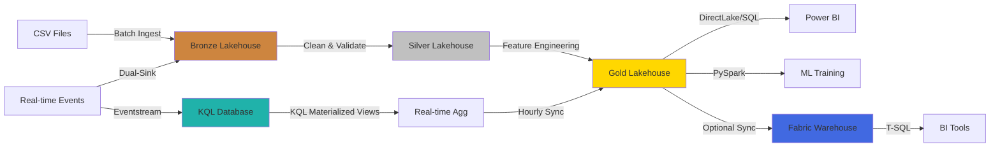
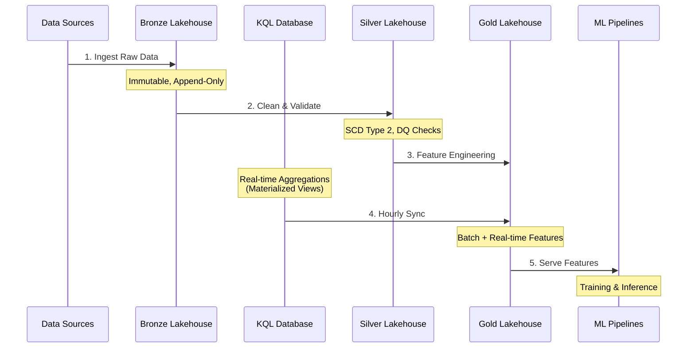

# Insurance ML Data Platform

<div align="center">


**Production-Ready Medallion Architecture for ML Workflows on Microsoft Fabric**

[Features](#-key-features) •
[Architecture](#%EF%B8%8F-architecture) •
[Quick Start](#-quick-start) •
[Project Structure](#-project-structure)

</div>

---

## 📋 Project Goals

This repository provides a **simplified, demonstration-focused** Medallion architecture for insurance ML workflows on Microsoft Fabric:

- ✅ **Fabric Native** - 100% Fabric services (Lakehouse only)
- ✅ **Medallion Pattern** - Bronze → Silver → Gold data flow
- ✅ **SCD Type 2** - Simplified historical tracking in Silver layer
- ✅ **Purview Integration** - Basic metadata tagging for data catalog
- ✅ **No Framework Dependencies** - All code inline in notebooks
- ✅ **Git Integration Ready** - Deploy via Fabric Git Integration

## 🚀 Key Features

| Feature | Description | Technology |
|---------|-------------|------------|
| **Medallion Layers** | Bronze (raw) → Silver (curated) → Gold (ML features) | Delta Lake, PySpark |
| **SCD Type 2** | Simplified historical tracking (effective_from, effective_to, is_current) | Delta Lake |
| **Data Quality** | Basic null checks, duplicate detection inline | PySpark |
| **Purview Metadata** | Table descriptions via Delta properties | Delta Lake options |
| **Deployment** | Fabric Git Integration (Azure DevOps or GitHub) | Fabric Git Integration |

## 🏗️ Architecture

### Medallion Design



### Data Flow Sequence



## 🔧 Key Components & Technology

| Component | Description | Technology Stack |
|-----------|-------------|------------------|
| **Lakehouse Storage** | Delta Lake tables with ACID transactions | Microsoft Fabric Lakehouse, Delta Lake 3.0 |
| **Data Processing** | Distributed ETL/ELT transformations | PySpark 3.5 (Fabric runtime) |
| **SQL Access** | SQL endpoint (automatic) + Warehouse (optional) | Lakehouse SQL Endpoint, Fabric Warehouse |
| **Streaming** | Real-time event ingestion & processing | Eventstream, KQL Database |
| **Orchestration** | Pipeline scheduling & dependencies | Fabric Data Pipelines (master pipelines) |
| **CI/CD** | Automated deployment automation | Azure DevOps, Fabric Deployment Pipelines |
| **Data Quality** | Dual validation system: standard validators (inline) + Great Expectations (gate) | Custom validators (6 functions), Great Expectations |
| **Secrets Management** | Secure credential storage | Azure Key Vault |
| **Monitoring** | Pipeline metrics & alerting | Fabric Monitoring Hub, KQL Queries |
| **Data Governance** | Data catalog, lineage tracking, metadata management | Microsoft Purview Hub (native Fabric integration) |

## 📂 Project Structure

```
Insurance-ML-Data-Platform/
│
├── lakehouse/                         # Medallion Notebooks (12 notebooks)
│   ├── bronze/notebooks/              # Raw data ingestion (4 notebooks)
│   │   ├── ingest_policies.py                 # Policies ingestion
│   │   ├── ingest_claims.py                   # Claims ingestion
│   │   ├── ingest_customers.py                # Customers ingestion
│   │   └── ingest_agents.py                   # Agents ingestion
│   │
│   ├── silver/notebooks/              # Data cleansing (4 notebooks)
│   │   ├── clean_policies.py                  # Clean + SCD Type 2 for policies
│   │   ├── clean_claims.py                    # Clean + SCD Type 2 for claims
│   │   ├── clean_customers.py                 # Clean + SCD Type 2 for customers
│   │   └── clean_agents.py                    # Clean + SCD Type 2 for agents
│   │
│   └── gold/notebooks/                # ML features (3 notebooks)
│       ├── create_claims_features.py          # Claims aggregations
│       ├── create_customer_features.py        # Customer features
│       └── create_risk_features.py            # Risk scores
│
├── pipelines/                         # Orchestration
│   └── master_batch_pipeline.json     # Bronze → Silver → Gold pipeline
│
├── devops/
│   └── parameters/
│       └── fabric.yml                 # Fabric workspace config (Git Integration)
│
├── samples/batch/                     # Sample CSV data (4 files)
│   ├── policies.csv
│   ├── claims.csv
│   ├── customers.csv
│   └── agents.csv
│
├── .gitignore
├── LICENSE
├── requirements.txt                   # PySpark + Delta Lake (reference only)
└── README.md
```

## 🚀 Quick Start

### Prerequisites

- Azure subscription with Microsoft Fabric capacity
- Azure DevOps or GitHub repository (for Git Integration)

### Deployment via Fabric Git Integration

**推薦方法** - 使用 Fabric Native Git Integration:

```bash
# 1. Create Fabric Workspace
# - Navigate to Fabric Portal
# - Create workspace: Insurance-ML-Platform
# - Create Lakehouses: lh_bronze, lh_silver, lh_gold

# 2. Setup Git Integration
# - Workspace Settings → Git Integration
# - Connect to Azure DevOps or GitHub
# - Select repository: Insurance-ML-Data-Platform
# - Branch: main
# - Click "Sync"

# 3. Push changes to Git
git add .
git commit -m "Update notebooks"
git push origin main

# 4. Fabric auto-syncs notebooks and pipelines
# - All .py notebooks in lakehouse/ folder sync automatically
# - Pipelines in pipelines/ folder sync automatically
# - No manual deployment needed!
```

### Upload Sample Data & Run Pipeline

1. **Upload Sample CSV Files**
   ```bash
   # In Fabric Workspace → lh_bronze → Files
   # Upload files to: Files/samples/batch/
   # - policies.csv
   # - claims.csv
   # - customers.csv
   # - agents.csv
   ```

2. **Run Master Pipeline**
   ```bash
   # In Fabric Workspace:
   # - Navigate to Pipelines → master_batch_pipeline
   # - Click "Run"
   # - Pipeline executes: Bronze → Silver → Gold
   ```

3. **Verify Results**
   ```bash
   # Check created Delta tables in each Lakehouse:
   # - lh_bronze: bronze_policies, bronze_claims, bronze_customers, bronze_agents
   # - lh_silver: silver_policies, silver_claims, silver_customers, silver_agents (with SCD2 columns)
   # - lh_gold: gold_claims_features, gold_customer_features, gold_risk_features
   ```

## 📚 Code Examples

### SCD Type 2 Implementation (Simplified)

All Silver notebooks include basic SCD2 tracking:

```python
# Add SCD Type 2 columns
df_cleaned = df_cleaned \
    .withColumn("effective_from", col("ingestion_timestamp")) \
    .withColumn("effective_to", lit(None).cast("timestamp")) \
    .withColumn("is_current", lit(True))
```

### Purview Metadata Integration

Table descriptions are added via Delta table properties:

```python
# Write with Purview metadata
df_cleaned.write \
    .format("delta") \
    .mode("overwrite") \
    .option("description", "Silver layer: Cleaned policies with SCD Type 2 tracking") \
    .save("Tables/silver_policies")

# Fabric automatically syncs to Purview Hub for data catalog
```

## 📖 Architecture Summary

Simplified Medallion architecture for demonstration:

### Core Patterns

1. **Medallion Data Flow**
   - **Bronze Layer**: Raw CSV ingestion (4 notebooks)
   - **Silver Layer**: Data cleaning + SCD Type 2 (4 notebooks)
   - **Gold Layer**: Feature aggregations (3 notebooks)

2. **SCD Type 2 Tracking**
   - Simplified historical tracking with `effective_from`, `effective_to`, `is_current` columns
   - Applied to all Silver dimension tables (policies, claims, customers, agents)

3. **Data Quality**
   - Basic inline validation (null checks, duplicate detection)
   - No complex framework dependencies

4. **Purview Integration**
   - Table descriptions via Delta `.option("description", "...")`
   - Auto-sync to Purview Hub for data catalog

5. **Deployment**
   - Fabric Git Integration (recommended)
   - Auto-sync on git push
   - No manual deployment scripts needed

## 📝 License

This project is licensed under the MIT License - see the LICENSE file for details.

## 👥 Author

**Patrick Cheung**  
Simplified demonstration platform for Microsoft Fabric Medallion architecture

---

<div align="center">

**[⬆ Back to Top](#insurance-ml-data-platform)**

Simplified Demo | Fabric Native | Delta Lake | SCD Type 2 | Purview Ready

</div>
